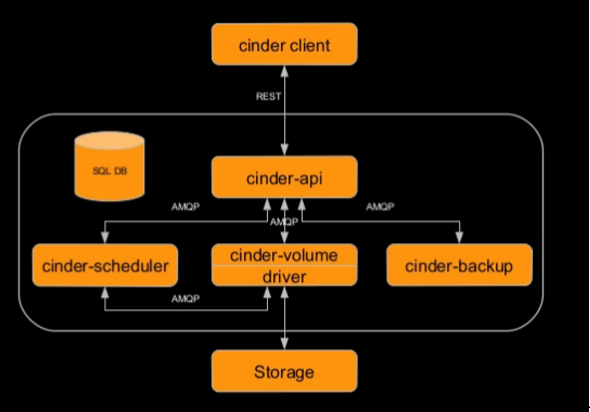
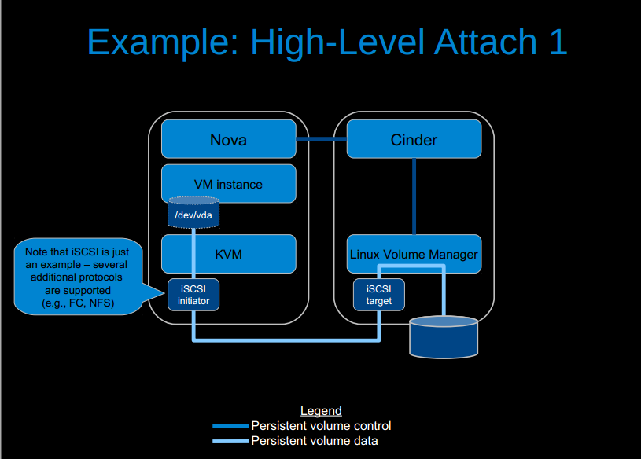
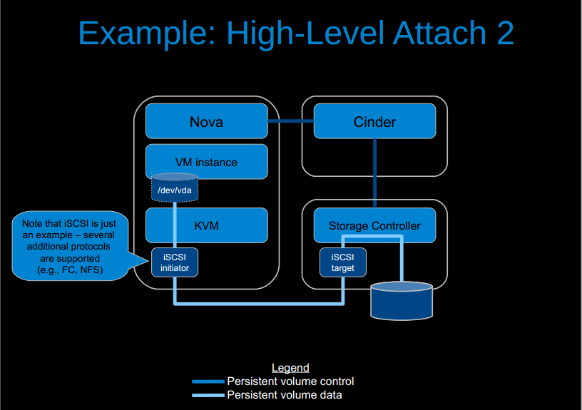
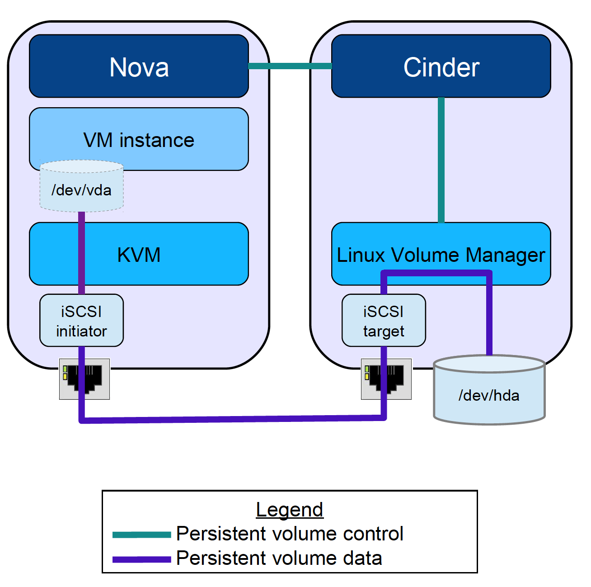
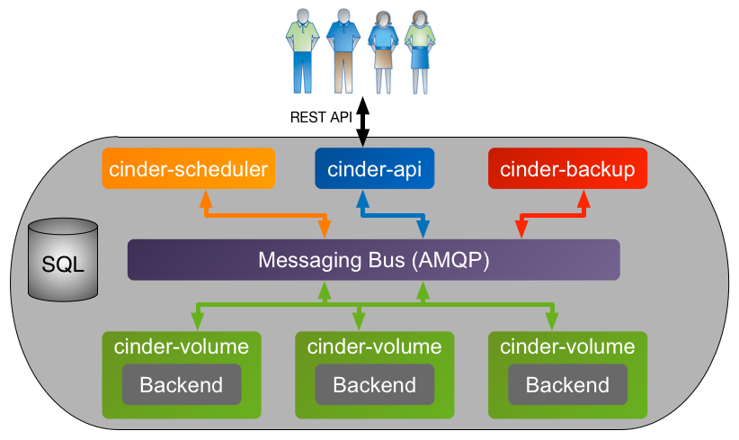
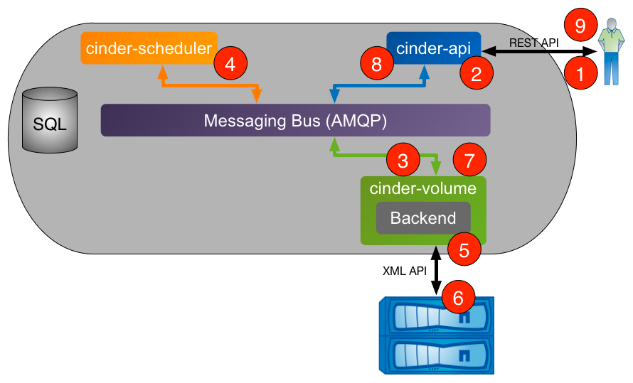
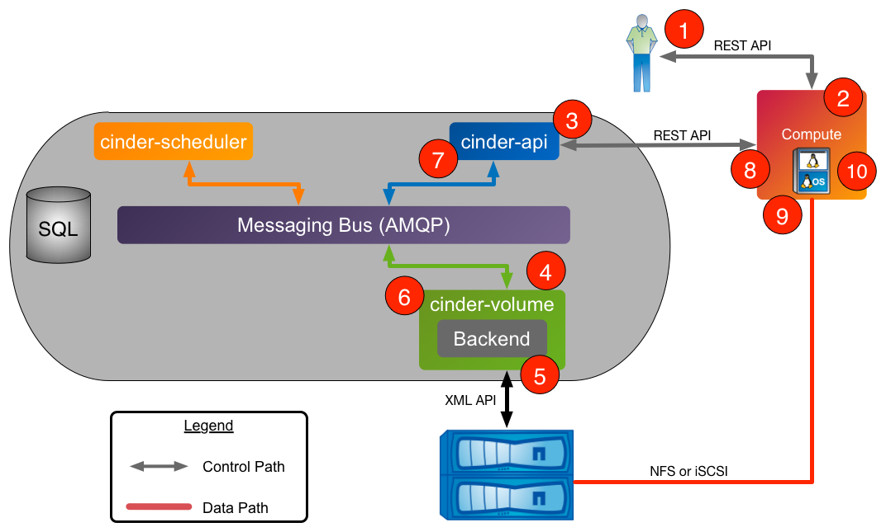

# Cinder
## Khái niệm
Cinder là 1 Block Storage service cung cấp thiết bị lưu trữ theo kiểu persistent block đến instance.  
## Chức năng
- Các volume có thể được detach khỏi 1 VM và attach vào 1 VM khác mà vẫn giữ nguyên dữ liệu  
- 1 Volume chỉ được attach vào 1 VM  
- Volume tồn tại độc lập với VM  
- Cung cấp API  

## Kiến trúc
  
- cinder-api: Accept và định tuyến các request  
- cinder-scheduler: lập lịch và định tuyến các request tới volume thích hợp  
- cinder-volume: quản lý các thiết bị Block Storage  
- cinder-backup: Cung cấp phương thức để backup volume đến Swift/Ceph  
- cinder-client: CLI/UI để tạo request  
- drive: chứa các backend xác định để liên kết với nhiều loại storage khác nhau  
- Storage: Thiết bị lưu trữ backend của các hãng khác nhau  
- SQL DB: Theo dõi các volume đang được sử dụng  

## Driver
- Cinder Driver map các Cinder request từ command lên platform mở rộng  
- có 2 loại high-level attach  

  
  
## Cinder attach flow
  
- Nova gọi Cinder thông qua Cinder API  
- Cinder API truyền message đến cinder-volume  
- Kiểm tra lỗi ban đầu và gọi đến cinder driver  
- Volume driver chuẩn bị các yếu tố cần thiết để cho phép kết nối  
- Volume driver trả lại thông tin kết nối chuyển đến Nova  
- Nova tạo kết nối đến storage sử dụng thông tin nhận được  
- Nova chuyển volume đến instance  

## Cinder workflow
### Cinder Processes Concept Diagram
  
### Volume Creation Workflow
  
- Client yêu cầu tạo volume thông qua REST API của cinder  
- cinder-api sẽ xác thực yêu cầu. Khi xác thực thành công, put message lên AMQP queue để xử lý  
- cinder-volume xử lý message queue, gửi message cho cinder-scheduler để xác định backend cung cấp cho volume  
- cinder-scheduler xử lý message queue, sinh ra danh sách các ứng viên (node storage) dựa trên trạng thái hiện tại và yêu cầu tiêu chí về volume criteria (size, availability zone, volume type (including extra specs))  
- cinder-volume đọc thông tin trả lời cinder-scheduler từ queue, lặp lại danh sách ứng viên bằng phương thức backend driver cho đến khi thành công  
- Cinder driver tạo volume được yêu cầu thông qua tương tác với hệ thống con storage  
- cinder-volume tập hợp volume metadata từ queue và kết nối thông tin và chuyển message trả lời đến AMQP queue  
- cinder-api đọc message trả lời từ queue và trả lời client  
- Client nhận được thông tin bao gồm trạng thái của yêu cầu tạo volume: volume UUID, etc...  

### Volume Attach Workflow
  
- Client yêu cầu attach volume thông Nova Rest API  
- nova-api xác thực yêu cầu. Khi xác thực thành công, gọi Cinder API để lấy thông tin về volume  
- cinder-api xác thực yêu cầu. Khi được xác thực thành công, post message đến volume manager thông qua AMQP  
- cinder-volume đọc message từ queue, gọi Cinder driver tương ứng đến volume để attached  
- Cinder driver chuẩn bị Cinder volume cho việc attachment  
- cinder-volume post thông tin trả lời đến cinder-api thông qua AMQP queue  
- cinder-api đọc message trả lời từ cinder-volume từ queue, truyền thông tin kết nối trong RESTful reponse đến Nova caller  
- Nova tạo kết nối đến storage với thông tin trả lại từ Cinder  
- Nova truyền volume đến hypervisor, sau đó attach volume đến guest VM  

