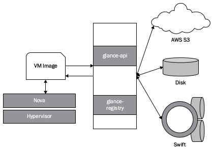
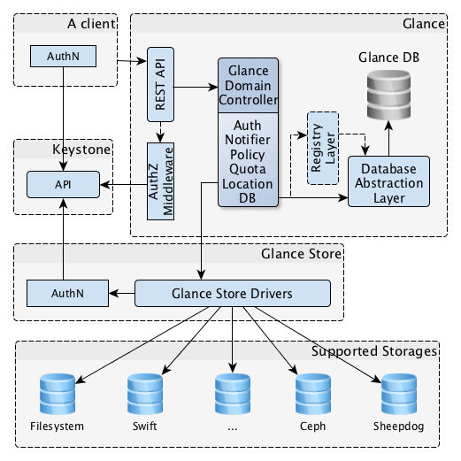
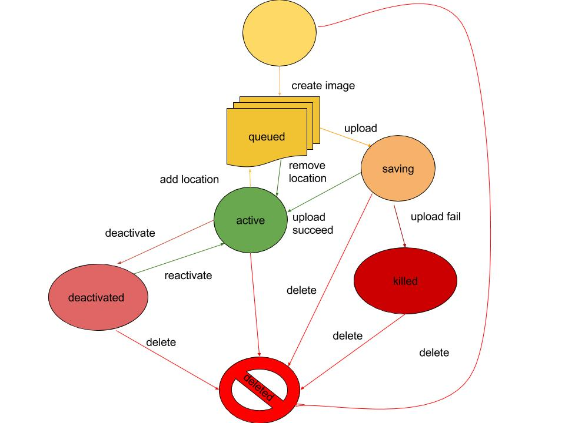

# Glance
Glance là 1 dịch vụ bắt buộc của OpenStack, nếu không có service này thì Nova sẽ không biết lấy image ở đâu. Glance được cài đặt trên controller node.  
  
## Glance Components
Các thành phần của Glance:  
- glance-api chấp nhận các API call để lấy và lưu trữ images  
- glance-registry lưu trữ, xử lý và lấy thông tin metadata cho images  
- database lưu trữ images metadata  
- storage repository tích hợp với các thành phần OpenStack bên ngoài khác.  

## Glance Architecture
Glance có cấu trúc client-server và cung cấp API qua đó các yêu cầu đến server được thực hiện. Yêu cầu từ client được chấp nhận thông qua Rest API và chờ xác thực từ KeyStone. Glance Domain Controller quản lý tất cả các hoạt động nội bộ, được chia thành các lớp, mỗi lớp thực hiện nhiệm vụ khác nhau.  
Glance store là lớp giúp giao tiếp giữa Glance và backend storage bên ngoài và cung cấp giao diện thống nhất để truy cập. Glance sử dụng cơ sở dữ liệu SQL để có thể truy cập vào mọi thành phần trong hệ thống.  
  
- Client: Các ứng dụng sử dụng Glance  
- REST API: Dùng để gọi đến các chức năng của Glance thông qua API  
- Database Abstraction Layer (DAL): API để thống nhất giao tiếp giữa Glance và Database  
- Glance Domain Controller: trung gian thực hiện các chức năng chính của Glance là authorization, notification, policy, database connection.  
- Glance Store: tương tác giữa Glance và các kho dữ liệu khác  
- Registry Layer: 1 lớp trao đổi thông tin an toàn giữa các miền và các DAL bằng cách sử dụng dịch vụ riêng biệt  

## Glance Formats
Khi upload image lên glance, phải chỉ rõ định dạng của VM images. Glance hỗ trợ nhiều kiểu định dạng như Disk format và Contianer format.  

## Glance Status Flow
Glance Status Flow cho biết tình trạng của Image khi upload. Khi khởi tạo 1 image, bước đầu tiên là queuing. Image được sắp xếp vào hàng đợi trong thời gian ngắn để định danh và sẵn sàng upload. Sau khi kết thúc thời gian queuing thì image sẽ được upload đến saving, các image upload thành công sẽ được đưa vào trạng thái active, không thành công được đưa vào killed hoặc deleted.  
  

## Glance Configuration Files
Các file cấu hình glance nằm trong thư mục `/etc/glance`:  
- glance-api.conf: File cấu hình glance API  
- glance-registry.conf: File cấu hình glance registry để lưu trữ metadata về images  
- glance-scrubber.conf: Tiện ích dùng để clean các image đã xóa  
- policy.json: Kiểm soát truy cập cho các image service. Có thể định nghĩa role, policy trong file này, nó là tính năng bảo mật của Glance  

## Image & Instance
Image được lưu trữ như các template. Glance điều khiển việc lưu trữ và quản lý images. Instance là 1 VM độc lập chạy trên compute node. 1 image có thể sử dụng cho vô số các VM, mỗi lần chạy 1 VM thì image sẽ được sao chép từ base image, việc thay đổi, chỉnh sửa trên VM không làm ảnh hưởng đến base image đó. Chúng ta có thể snapshot 1 instance và chạy nó như 1 instance khác.  
Khi chạy 1 instance cần xác định flavor (các tài nguyên ảo). Flavor xác định bao nhiều vCPU, RAM sẽ được gán cho instance đó.  

## Glance Flow
  
