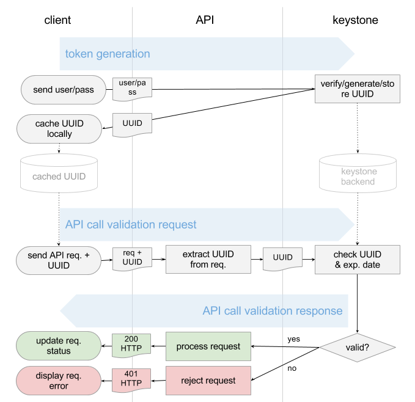
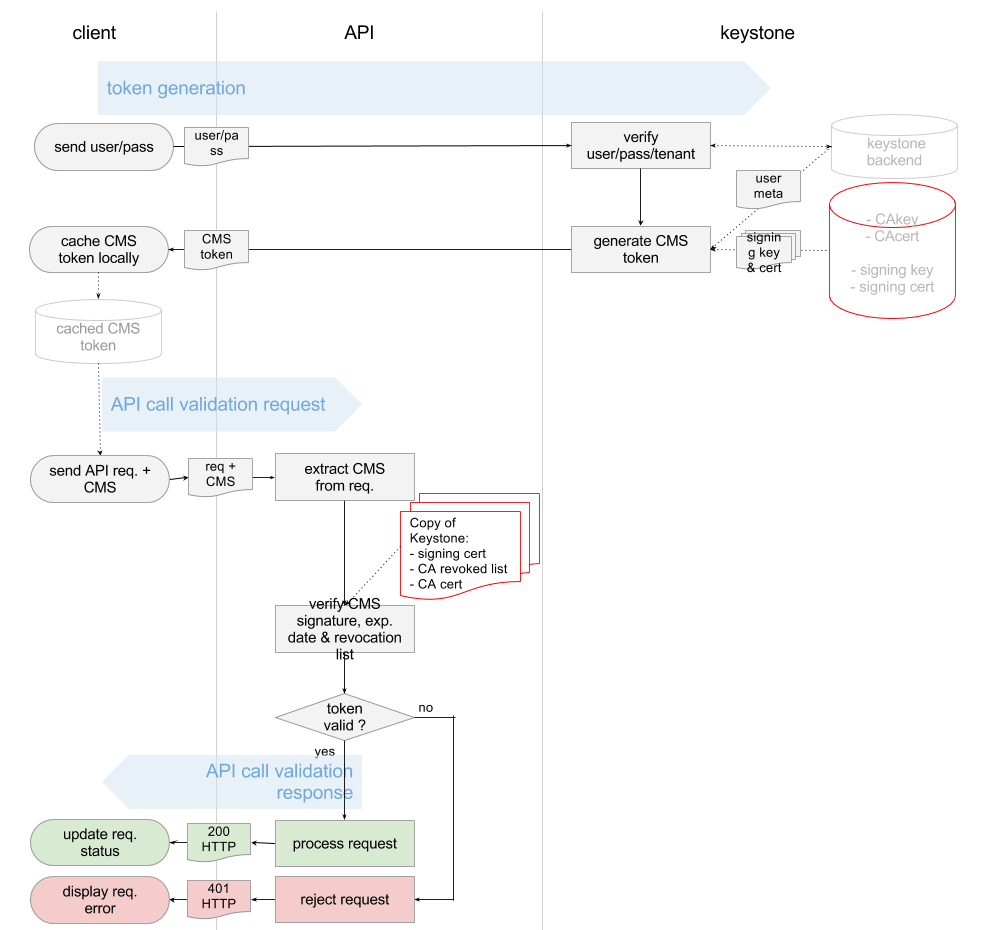
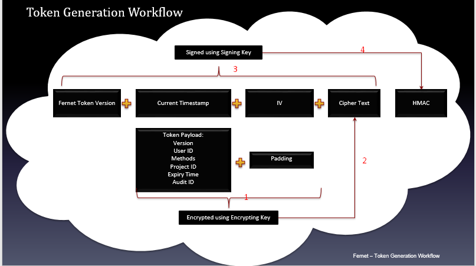
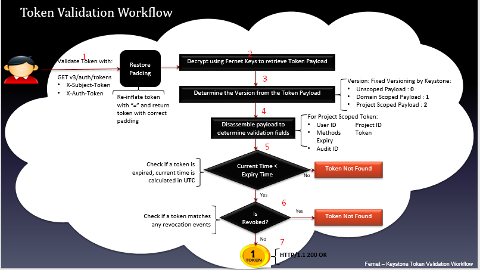

# KeyStone
## KeyStone Concepts
### Project (Tenent)
Nhóm và cô lập các tài nguyên trong OpenStack. Các User và Group được cấp quyền truy cập vào Project bằng các Role.  
### Domain
Là một tập hợp các project, user, group.  
### Users
Đại diện cho 1 người hoặc 1 dịch vụ với 1 tập hợp các thông tin xác thực như username, password và API key. User cần phải thuộc ít nhất 1 Project (Tenent)  
### User Groups
Là 1 nhóm các User.  
### Role
Role quyết định những gì User được phép thực hiện. Các Role được định nghĩa trong `/etc/keystone/policy.json`  
### Assignment 
Là sự kết hợp của 1 Role, 1 Target (Project & Domain), 1 Actor (Users & User Groups)  
### Token
Sau khi xác thực thành công với KeyStone, user sẽ nhận được token. Để gọi đến các API của OpenStack, token phải được truyền vào API call.
### Catalog
Chứa các URL và các endpoint của dịch vụ Cloud khác nhau. Catalog được chia thành một danh sách các endpoint, mỗi endpoint được chia thành 1 admin URL, internal URL và public URL. Nếu không có catalog, users và các ứng dụng sẽ không biết nơi gửi yêu cầu tạo VM hoặc lưu trữ object.  

## Identity 
Identity xác minh các thông tin và dữ liệu của User và Group User. Nó có thể lưu trữ dữ liệu của người dùng trong CSDL hoặc lấy dữ liệu từ LDAP. Nếu CSDL cục bộ được sử dụng, Identity có khả năng tạo, đọc, cập nhật và xóa.  

## Authentication
Có nhiều cách để xác thực với KeyStone, thông dụng nhất là dùng password hoặc token.  

## Token Format
Token là 1 phần dữ liệu được gửi cho User bởi KeyStone khi cung cấp chính xác username & passwd. User có thể lưu trữ Token và đưa nó vào 1 yêu cầu API. Các Endpoint lấy Token ra khỏi yêu cầu của User và xác nhận tính hợp lệ của nó.
### UUID Tokens
  
Quá trình Tạo & Xác nhận Token của KeyStone:  
- KeyStone tạo ngẫu nhiên 32 ký tự UUID Token, nó được lưu trong 1 per-sistent backend của KeyStone (VD như CSDL) rồi gửi cho Client.  
- Client cache token và token sẽ được chuyển tiếp cùng với mỗi API call.  
- Khi nhận được request của Client, các endpoint sẽ gửi lại UUID cho KeyStone để xác nhận.  
- KeyStone kiểm tra UUID nhận được với UUID trong database để kiểm tra và sẽ trả lại thông báo "success" hoặc "failure" cho endpoint.  

Vì UUID Tokens được lưu trong backend, khi phải lưu số lượng lớn Token, hiệu suất của KeyStone sẽ giảm dần. Tất cả các service cần ping đến KeyStone để xác nhận, lượng truy cập đến KeyStone sẽ rất lớn, tạo ra 1 nút thắt cổ chai.
### PKI Tokens
  
PKI Token chứa toàn bộ phản hồi cho phép nhận được từ KeyStone. Nó chứa 1 lượng lớn thông tin như thời gian phát hành, hết hạn, project,... Tất cả các thông tin được lưu trong JSON payload, được ký sử dụng cryptographic messaga syntax (CMS). Với định dạng PKIz, payload sau đó được nén bởi zlib.  
Nhược điểm của PKI Token là rất khó để cấu hình, KeyStone vẫn phải duy trì các Token này trong persistent backend và quan trong nhất là vì mang tất cả các thông tin nên kích thước của nó rất lớn.

### Fernet Tokens
Fernet Token có khoảng 255 ký tự, Fernet Token chứa đủ thông tin để cho phép Token không phải lưu trữ trong 1 persisten KeyStone token database.   
Fernet Token chứa lượng thông tin nhỏ như user identifier, project identifier, thời gian hết hạn của token,... Fernet Token giống với UUID Token, chúng sẽ được xác nhận bởi KeyStone. Fernet Token được sign bằng cách sử dụng khóa đối xứng để ngăn ngừa giả mạo, các key cần được phân phối đến các OpenStack region giúp lượng truy cập đến KeyStone giảm và các key sẽ được rotate (xoay vòng) để đảm bảo tính bảo mật.  
  
  
Quá trình tạo và xác thực token.  

