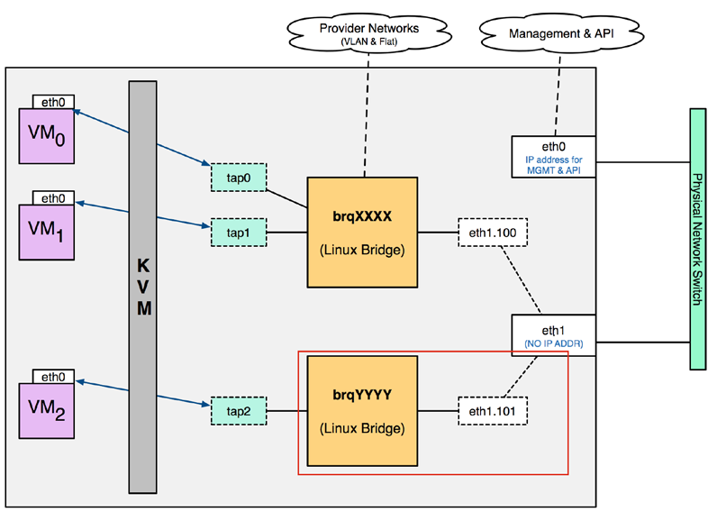
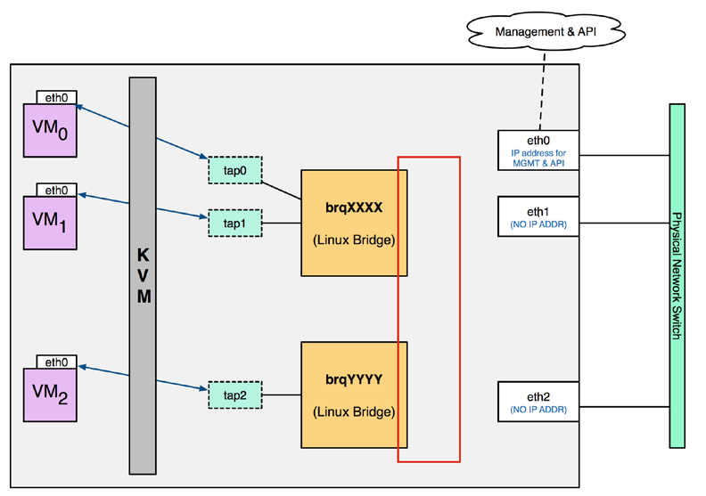

# Neutron
## Khái niệm cơ bản
- Network: Là 1 miền broadcast riêng biệt ở layer 2. Thường dành riêng cho mỗi tenent, các subnet và port phải kết nối đến network  
- Subnet: Là 1 dải mạng CIDR dùng để phân bố các IP đến instance  
- Port: Là kêt nối của 1 Interface mạng ảo tới 1 subnet. Các port có thể được liên kết với VM, DHCP Server,...   

## Plugin
- Core Plugin: Được sử dụng để quản lý các tài nguyên như network, subnet,...  
- Service Plugin: Được sử dụng để quản lý các dịch vụ cao hơn như route, firewall,...  

### ML2 Plugin
ML2 Plugin cho phép Neutron sử dụng nhiều công nghệ mạng layer 2 như OpenvSwitch, Linux Bridge,... 
- Type Driver: Duy trì trạng thái của từng mạng riêng biệt, xác thực thuộc tính của provider network và phân phối network đến các project. Các loại mạng được hỗ trợ gồm local, flat, vlan, vxlan, gre.  
- Mechanism Driver: Chịu trách nhiệm lấy thông tin được thiết lập bởi Type Driver và đảm bảo nó thực hiện đúng. VD: OpenvSwich, Linux Bridge, L2 Population,...  

## Network Type
- Local Network: Là mạng cô lập với các network và các node khác. Các Instance kết nối với local network có thể giao tiếp với nhau nhưng không thể giao tiếp với các local network khác.  
- Flat network: Trong mạng này sẽ không gắn tag VLAN hay phân chia mạng  
- VLAN network: Sử dụng VLAN để phân chia lưu lượng mạng. Các instance trong cùng VLAN sẽ nằm cùng 1 broadcast domain. Định tuyến giữa các VLAN phải thông qua Router.  
- VXLAN network: Sử dụng ID duy nhất (VNI) để phân biệt lưu lượng với các mạng VXLAN khác. Lưu lượng sẽ được đóng gói và gửi qua mạng Layer 3 bằng UDP sau đó được decap và chuyển tới instance  
- GRE network: Giống VXLAN nhưng sử dụng IP protocol 47 thay vì UDP  

## Traffic flow using Linux Bridge
### VLAN
  
### Flat 
  
### Local
  

## Traffic flow using OVS
### Flat network
Flat network là mạng sẽ không gắn tag VLAN nhưng trong OpenvSwitch, Flat network vẫn sẽ được gán Local VLAN ID vào, các instance trong cùng Linux Bridge sẽ có cùng Local VLAN. Nhưng trong Flat Network, ở Integration và Provider Bridge, thay vì map Local VLAN ID tới 1 VLAN ID vật lý thì Local VLAN ID sẽ được gỡ bỏ.  

## Router Redundancy
Các virutal Router sẽ sử dụng VRRP để cung cấp tính dự phòng. Các vRouter nằm trong 1 group, 1 vRouter được chỉ định là Master, các vRouter khác sẽ là Backup. Khi Master fail, các Backup sẽ lên thay và nắm giữ vIP, các interface qr, qg sẽ được bật.  
## Distributed Virtual Router
DVR cung cấp kết nối giữa self-service network và provider network trên compute node trong một số TH. Các instance có floating IPv4, việc định tuyến giữa self-service network và provider network nằm hoàn toàn trên compute node. Các instance có fixed IP vẫn dựa vào network node để định tuyến và SNAT giữa self-service network và provider network.

