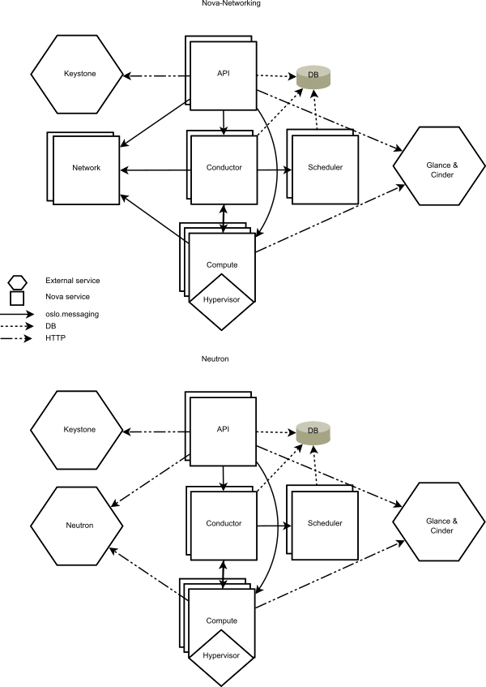
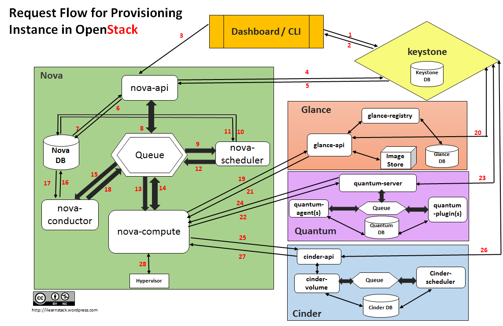

# Nova
- Nova quản lý các VM trong OpenStack. Nó gồm tập hợp các daemon chạy trên hệ thống máy chủ Linux để cung cấp dịch vụ.  
- Nova cung cấp REST API để tương tác với client, còn các thành phần bên trong Nova tương tác với nhau thông qua RPC.  
- Nova sử dụng chung CSDL chia sẻ giữa các thành phần. CSDL được truy cập thông qua nova-conductor để đảm bảo các thành phần kiểm soát đã nâng cấp vẫn có thể giao tiếp với nova-compute ở phiên bản trước đó.  

## Kiến trúc Nova
  
- nova-api (service): Tiếp nhận và phản hồi API call, HTTP request. Chuyển đổi các lệnh và giao tiếp với các thành phần khác thông qua oslo.messaging hoặc HTTP.  
- nova-api-metadata (service): Tiếp nhận yêu cầu lấy metadata từ instance.  
- nova-compute (service): Quản lý instance thông qua các Hypervisor API. Về cơ bản nó tiếp nhận các hành động từ hàng đợi và thực hiện một chuỗi các lệnh vận hành VM và cập nhật trạng thái của VM vào database.  
- nova-scheduler (service): Nó lấy các yêu cầu tạo VM từ hàng đợi và xác định xem VM sẽ được tạo ở Host nào.  
- nova-conductor (module): Là module trung gian giữa nova-compute và CSDL. Nó hủy tất cả các yêu cầu trực tiếp vào CSDL của nova-compute.  
- nova-network : tiếp nhận yêu cầu về network từ hàng đợi và control network.  
- nova-novncproxy (daemon): Cung cấp proxy để truy cập VM thông qua VNC. Hỗ trợ novnc client trên trình duyệt.  
- nova-spicehtml5proxy (daemon): Cung cấp proxy để truy cập VM thông qua SPICE. Hỗ trợ client chạy trên trình duyệt HTML5.  
- nova-xvpvncproxy (daemon): Cung cấp proxy để truy cập VM thông qua VNC.  
- nova-consoleauth (daemon): Ủy quyền token cho người dùng mà console proxy cung cấp.  
- The queue: Trung tâm chuyển tiếp bản tin giữa các daemon. Cung cấp bởi 1 phần mềm message queue hỗ trợ giao thức AMQP như RabbitMQ, ZeroMQ.  

## Quá trình tạo Instance 
  
- Bước 1: Từ Dashboard hoặc CLI, nhập thông tin chứng thực (ví dụ: user name và password) và thực hiện lời gọi REST tới Keystone để xác thực  
- Bước 2: Keystone xác thực thông tin người dùng và tạo ra một token xác thực gửi trở lại cho người dùng, mục đích là để xác thực trong các bản tin request tới các dịch vụ khác thông qua REST  
- Bước 3: Dashboard hoặc CLI sẽ chuyển yêu cầu tạo máy ảo mới thông qua thao tác "launch instance" trên openstack dashboard hoặc "nova-boot" trên CLI, các thao tác này thực hiện REST API request và gửi yêu cầu tới nova-api  
- Bước 4: nova-api nhận yêu cầu và hỏi lại keystone xem auth-token mang theo yêu cầu tạo máy ảo của người dùng có hợp lệ không và nếu có thì hỏi quyền hạn truy cập của người dùng đó.  
- Bước 5: Keystone xác nhận token và update lại trong header xác thực với roles và quyền hạn truy cập dịch vụ lại cho nova-api  
- Bước 6: nova-api tương tác với nova-database  
- Bước 7: Dababase tạo ra entry lưu thông tin máy ảo mới  
- Bước 8: nova-api gửi rpc.call request tới nova-scheduler để cập nhật entry của máy ảo mới với giá trị host ID (ID của máy compute mà máy ảo sẽ được triển khai trên đó). (Chú ý: yêu cầu này lưu trong hàng đợi của Message Broker - RabbitMQ)  
- Bước 9: nova-scheduler lấy yêu cầu từ hàng đợi  
- Bước 10: nova-scheduler tương tác với nova-database để tìm host compute phù hợp thông qua việc sàng lọc theo cấu hình và yêu cầu cấu hình của máy ảo  
- Bước 11: nova-database cập nhật lại entry của máy ảo mới với host ID phù hợp sau khi lọc.  
- Bước 12: nova-scheduler gửi rpc.cast request tới nova-compute, mang theo yêu cầu tạo máy ảo mới với host phù hợp.  
- Bước 13: nova-compute lấy yêu cầu từ hàng đợi.  
- Bước 14: nova-compute gửi rpc.call request tới nova-conductor để lấy thông tin như host ID và flavor(thông tin về RAM, CPU, disk) (chú ý, nova-compute lấy các thông tin này từ database thông qua nova-conductor vì lý do bảo mật, tránh trường hợp nova-compute mang theo yêu cầu bất hợp lệ tới instance entry trong database)  
- Bước 15: nova-conductor lấy yêu cầu từ hàng đợi  
- Bước 16: nova-conductor tương tác với nova-database  
- Bước 17: nova-database trả lại thông tin của máy ảo mới cho nova-conductor, nova condutor gửi thông tin máy ảo vào hàng đợi.  
- Bước 18: nova-compute lấy thông tin máy ảo từ hàng đợi  
- Bước 19: nova-compute thực hiện lời gọi REST bằng việc gửi token xác thực tới glance-api để lấy Image URI với Image ID và upload image từ image storage.  
- Bước 20: glance-api xác thực auth-token với keystone  
- Bước 21: nova-compute lấy metadata của image(image type, size, etc.)  
- Bước 22: nova-compute thực hiện REST-call mang theo auth-token tới Network API để xin cấp phát IP và cấu hình mạng cho máy ảo  
- Bước 23: quantum-server (neutron server) xác thực auth-token với keystone  
- Bước 24: nova-compute lấy thông tin về network  
- Bước 25: nova-compute thực hiện Rest call mang theo auth-token tới Volume API để yêu cầu volumes gắn vào máy ảo  
- Bước 26: cinder-api xác thực auth-token với keystone  
- Bước 27: nova-compute lấy thông tin block storage cấp cho máy ảo  
- Bước 28: nova-compute tạo ra dữ liệu cho hypervisor driver và thực thi yêu cầu tạo máy ảo trên Hypervisor (thông qua libvirt hoặc api - các thư viện tương tác với hypervisor)  

## Reboot
### Reboot on Server
Normal reboot, PID của server trên compute node không thay đổi
### Soft reboot
Vì mỗi instance là 1 tiến trình trên compute node, nên khi sử dụng soft reboot thì tiến trình này sẽ được khởi động lại, PID được làm mới
### Hard reboot
instance sẽ được define lại như 1 instance mới, các thông số port và storage được làm mới trên compute node 
