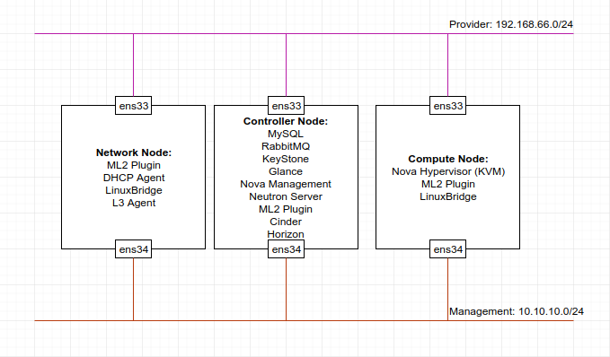

# Mô hình cài đặt
Mô hình cài đặt lab OpenStack Pike trên Ubuntu 16.04 64-bit.  
  
# IP Planning
  
# Cài đặt môi trường 
## Cấu hình Network
Đặt địa chỉ IP như bảng phân hoạch địa chỉ IP ở trên. Restart service để áp dụng thay đổi
```
service networking restart
```
Cấu hình file host
```
10.10.10.11 controller
10.10.10.21 compute
10.10.10.31 network
```
## Cài đặt NTP
Trên cả 3 node cài đặt NTP
```
apt-get install -y chrony
```
### Controller Node
Cấu hình file `/etc/chrony/chrony.conf` như sau:
```
#pool 2.debian.pool.ntp.org offline iburst
server 1.vn.pool.ntp.org iburst
server 0.asia.pool.ntp.org iburst 
server 3.asia.pool.ntp.org iburst

allow 10.10.10.0/24
```
Restart dịch vụ NTP
```
service chrony restart
```
Kiểm tra hoạt động của NTP
```
root@controller:~# chronyc sources
210 Number of sources = 3
MS Name/IP address         Stratum Poll Reach LastRx Last sample
===============================================================================
^? mail.khangthong.vn            0   6     0   10y     +0ns[   +0ns] +/-    0ns
^? 120.25.115.19                 2   6     3     1    +37ms[  +37ms] +/-  179ms
^? extendwings.com               2   6     5     0    +10ms[  +10ms] +/-   67ms
```
### Network Node & Compute Node
Trong file `/etc/chrony/chrony.config`
```
#pool 2.debian.pool.ntp.org offline iburst
server controller iburst
```
Restart dịch vụ NTP
```
service chrony restart
```
Kiểm tra hoạt động của NTP
```
root@network:~# chronyc sources
210 Number of sources = 1
MS Name/IP address         Stratum Poll Reach LastRx Last sample
===============================================================================
^* controller                    3   6   377    36    -16us[  -41us] +/-  193ms

root@compute:~# chronyc sources
210 Number of sources = 1
MS Name/IP address         Stratum Poll Reach LastRx Last sample
===============================================================================
^* controller                    3   6   377    48    -19us[  -88us] +/-  193ms

```
## Cài đặt OpenStack Pike
Trên cả 3 node cài đặt OpenStack Pike:    
Enable OpenStack repository
```
apt install -y software-properties-common
add-apt-repository -y cloud-archive:pike
```
Upgrade package
```
apt update -y
apt dist-upgrade -y
```
Cài đặt gói OpenStack client
```
apt install -y python-openstackclient
```
Reboot Host
```
init 6
```

## Cài đặt SQL Database
Các dịch vụ của OpenStack đều cần 1 CSDL để lưu trữ thông tin thường được cài đặt trên controller node.  
Cài MariaDB Server  
```
apt install -y mariadb-server python-pymysql
```
Tạo và chỉnh sửa file `/etc/mysql/mariadb.conf.d/99-openstack.cnf` như sau:  
Thiết lập `bind-address` bằng địa chỉ IP management của Controller Node để các node khác có thể truy cập qua management network.  
```
[mysqld]
bind-address = 10.10.10.11
default-storage-engine = innodb
innodb_file_per_table = on
max_connections = 4096
collation-server = utf8_general_ci
character-set-server = utf8
```
Restart dịch vụ database
```
service mysql restart
```
Chạy lệnh sau để cấu hình bảo mật cho CSDL
```
root@controller:~# mysql_secure_installation
Enter current password for root (enter for none): 
OK, successfully used password, moving on...
Set root password? [Y/n] 
New password: 
Re-enter new password: 
Password updated successfully!
Reloading privilege tables..
... Success!
Remove anonymous users? [Y/n] 
 ... Success!
Disallow root login remotely? [Y/n] 
 ... Success!
Remove test database and access to it? [Y/n] 
 - Dropping test database...
 ... Success!
 - Removing privileges on test database...
 ... Success!
Reload privilege tables now? [Y/n] 
 ... Success!

Cleaning up...

All done!  If you've completed all of the above steps, your MariaDB
installation should now be secure.

Thanks for using MariaDB!

```

## Message Queue
OpenStack sử dụng message queue để điều phối các hoạt động và thông tin trạng thái giữa các service. Message queue thường được cài đặt trên controller node.  
```
apt install -y rabbitmq-server
```
Add user openstack với password là RABBIT_PASS
```
rabbitmqctl add_user openstack RABBIT_PASS
```
Cho phép cấu hình, read, write cho user openstack
```
rabbitmqctl set_permissions openstack ".*" ".*" ".*"
```
## Memcached
Cơ chế xác thực của KeyStone cho các dịch vụ sử dụng memcached để cache các token. Memcached thường được cài đặt trên controller node. 
```
apt install -y memcached python-memcache
```
Chỉnh sửa file `/etc/memcached.conf` và cấu hình dịch vụ sử dụng IP management của controller node để cho phép các node khác truy cập thông qua management node
```
-l 10.10.10.11
```
Khởi động lại memcached
```
service memcached restart
```
