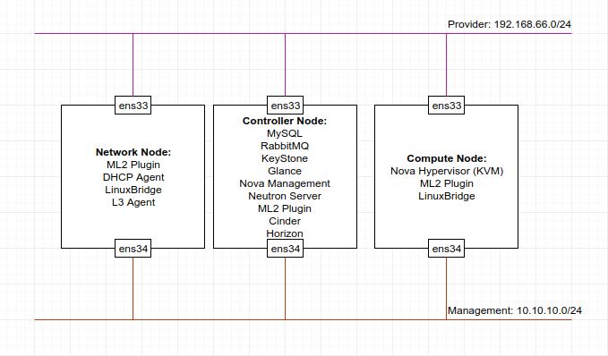
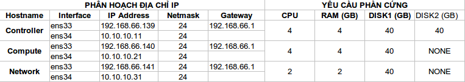

# Mô hình cài đặt
Mô hình cài đặt lab OpenStack Pike trên Ubuntu 16.04 64-bit.  
  
# IP Planning
  
# Cài đặt môi trường 
## Cấu hình Network
Đặt địa chỉ IP như bảng phân hoạch địa chỉ IP ở trên. Restart service để áp dụng thay đổi
```
service networking restart
```
Cấu hình file host
```
172.16.69.79 controller
172.16.69.90 controller1
172.16.69.83 controller2
172.16.69.57 controller3
172.16.69.66 network1
172.16.69.87 network2
172.16.69.96 network3
172.16.69.80 compute1
172.16.69.45 compute2
172.16.69.13 compute3
```

## Cài đặt keepalived trên 3 node controller
```
apt install keepalived -y
```
Cấu hình keepalived trong file `/etc/keepalived/keepalived.conf` 
```
## Controller1
vrrp_sync_group VG_1 {
    group {
        WAN_LAN_1
    }
}

vrrp_instance WAN_LAN_1 {
    state BACKUP
    interface eth1
    virtual_router_id 10
    dont_track_primary
    priority 100
    preempt_delay 30
    garp_master_delay 1
    advert_int 2
    authentication {
        auth_type PASS
        auth_pass dd9Mke2L2DNX
    }
    track_interface {
        eth1
    }
    virtual_ipaddress {
        172.16.69.79/24 dev eth1
    }
}

## Controller2
vrrp_sync_group VG_1 {
    group {
        WAN_LAN_1
    }
}

vrrp_instance WAN_LAN_1 {
    state BACKUP
    interface eth1
    virtual_router_id 10
    dont_track_primary
    priority 50
    preempt_delay 30
    garp_master_delay 1
    advert_int 2
    authentication {
        auth_type PASS
        auth_pass dd9Mke2L2DNX
    }
    track_interface {
        eth1
    }
    virtual_ipaddress {
        172.16.69.79/24 dev eth1
    }
}

## Controller3
vrrp_sync_group VG_1 {
    group {
        WAN_LAN_1
    }
}

vrrp_instance WAN_LAN_1 {
    state BACKUP
    interface eth1
    virtual_router_id 10
    dont_track_primary
    priority 45
    preempt_delay 30
    garp_master_delay 1
    advert_int 2
    authentication {
        auth_type PASS
        auth_pass dd9Mke2L2DNX
    }
    track_interface {
        eth1
    }
    virtual_ipaddress {
        172.16.69.79/24 dev eth1
    }
}
```
Restart service
```
service keepalived restart
```

## Cài đặt Percona XtraDB trên 3 node Controller
**1. Cài đặt MySQL Multi Cluster - Percona XtraDB**  
Xóa apparmor
```
sudo apt-get remove -y apparmor
```
Cấu hình Percona repo và update hệ điều hành  
```
wget https://repo.percona.com/apt/percona-release_0.1-6.$(lsb_release -sc)_all.deb
sudo dpkg -i percona-release_0.1-6.$(lsb_release -sc)_all.deb
sudo apt-get update
```
Cài đặt Percona XtraDB  
```
sudo apt-get install -y percona-xtradb-cluster-57 python-mysqldb python3-mysqldb 
```
Trong khi quá trình cài đặt diễn ra, hệ thống sẽ yêu cầu bạn nhập password cho tài khoản root của MySQL.  

**2. Cầu hình đồng bộ từng node**  
Chú ý: Sau khi cài đặt Percona thì dịch vụ Mysql tự động được bật, chúng ta cần tắt dịch vụ trên cả 3 node DB bằng lệnh:
```
/etc/init.d/mysql stop
```
**2.1 Controller1**  
Cấu hình file `/etc/mysql/percona-xtradb-cluster.conf.d/wsrep.cnf` như sau:  
```
[mysqld]
datadir=/var/lib/mysql
user=mysql

wsrep_provider=/usr/lib/galera3/libgalera_smm.so
wsrep_cluster_address=gcomm://172.16.69.90,172.16.69.83,172.16.69.57
binlog_format=ROW
default_storage_engine=InnoDB
wsrep_slave_threads= 8
wsrep_log_conflicts
innodb_autoinc_lock_mode=2
wsrep_node_address=172.16.69.90
wsrep_cluster_name=controller-cluster
wsrep_node_name=controller1
pxc_strict_mode=ENFORCING
wsrep_sst_method=xtrabackup-v2
wsrep_sst_auth="vccloud:vccorp"
```
Khởi động Node đầu tiên với câu lệnh
```
/etc/init.d/mysql bootstrap-pxc
```
Lệnh này sẽ khởi động nút đầu tiên và boostrap để kết nối với các máy còn lại Sau khi node đầu tiên được bật, ta có thể kiểm tra được trạng thái của cluster bằng lệnh sau:
```
show status like 'wsrep%';
```
Và chúng ta sẽ có kết quả giống như bên dưới:

|Variable_name|Value|
|-------------|------|
|wsrep_local_state_uuid|9358494f-bdf3-11e7-ba56-2bd5f2eb85be|
|...|...|
| wsrep_local_state| 4|
| wsrep_local_state_comment|Synced|
|...|...|
| wsrep_cluster_size|1|
| wsrep_cluster_status| Primary|
| wsrep_connected| ON|
|...|...|
| wsrep_ready| ON|

Trong MySQL, chúng ta tạo user mới và set quyền:
```
CREATE USER 'vccloud'@'localhost' IDENTIFIED BY 'vccorp';
GRANT PROCESS, RELOAD, LOCK TABLES, REPLICATION CLIENT ON *.* TO 'vccloud'@'localhost';
FLUSH PRIVILEGES;
exit;
```
**2.2 Controller2**
Cấu hình file **/etc/mysql/percona-xtradb-cluster.conf.d/wsrep.cnf** như sau:
```
[mysqld]
datadir=/var/lib/mysql
user=mysql

wsrep_provider=/usr/lib/galera3/libgalera_smm.so
wsrep_cluster_address=gcomm://172.16.69.90,172.16.69.83,172.16.69.57
binlog_format=ROW
default_storage_engine=InnoDB
wsrep_slave_threads= 8
wsrep_log_conflicts
innodb_autoinc_lock_mode=2
wsrep_node_address=172.16.69.83
wsrep_cluster_name=controller-cluster
wsrep_node_name=controller1
pxc_strict_mode=ENFORCING
wsrep_sst_method=xtrabackup-v2
wsrep_sst_auth="vccloud:vccorp"
```
Start node 2  
```
/etc/init.d/mysql start
```
**2.3 Controller3**
Cấu hình file **/etc/mysql/percona-xtradb-cluster.conf.d/wsrep.cnf** như sau:
```
[mysqld]
datadir=/var/lib/mysql
user=mysql

wsrep_provider=/usr/lib/galera3/libgalera_smm.so
wsrep_cluster_address=gcomm://172.16.69.90,172.16.69.83,172.16.69.57
binlog_format=ROW
default_storage_engine=InnoDB
wsrep_slave_threads= 8
wsrep_log_conflicts
innodb_autoinc_lock_mode=2
wsrep_node_address=172.16.69.57
wsrep_cluster_name=controller-cluster
wsrep_node_name=controller1
pxc_strict_mode=ENFORCING
wsrep_sst_method=xtrabackup-v2
wsrep_sst_auth="vccloud:vccorp"
```
Start node 3
```
/etc/init.d/mysql start
```

Vào mysql shell để tăng max_connection trên cả 3 node
```
SET GLOBAL max_connections=4096;
```
Quá trình cài đặt Percona Xtradb hoàn tất.  
 
## Cấu hình cần thiết
Cấu hình controller nonlocal bind và forward packet trong file `/etc/sysctl.conf`
```
net.ipv4.ip_nonlocal_bind = 1
net.ipv4.ip_forward = 1
```
Load lại sysctl
```
sysctl -p
```

## Cài đặt NTP
Trên tất cả các node cài đặt NTP
```
apt-get install -y chrony
```
### Controller Node
Cấu hình file `/etc/chrony/chrony.conf` như sau:
```
#pool 2.debian.pool.ntp.org offline iburst
server 1.vn.pool.ntp.org iburst
server 0.asia.pool.ntp.org iburst 
server 3.asia.pool.ntp.org iburst
allow 172.16.69.0/24
```
Restart dịch vụ NTP
```
service chrony restart
```
Kiểm tra hoạt động của NTP
```
root@controller1:~# chronyc sources
210 Number of sources = 3
MS Name/IP address         Stratum Poll Reach LastRx Last sample
===============================================================================
^? mail.khangthong.vn            0   6     0   10y     +0ns[   +0ns] +/-    0ns
^? 120.25.115.19                 2   6     3     1    +37ms[  +37ms] +/-  179ms
^? extendwings.com               2   6     5     0    +10ms[  +10ms] +/-   67ms
```
### Network Node & Compute Node
Trong file `/etc/chrony/chrony.conf`
```
#pool 2.debian.pool.ntp.org offline iburst
server controller iburst
```
Restart dịch vụ NTP
```
service chrony restart
```
Kiểm tra hoạt động của NTP
```
root@network1:~# chronyc sources
210 Number of sources = 1
MS Name/IP address         Stratum Poll Reach LastRx Last sample
===============================================================================
^* controller                    3   6   377    36    -16us[  -41us] +/-  193ms

root@compute1:~# chronyc sources
210 Number of sources = 1
MS Name/IP address         Stratum Poll Reach LastRx Last sample
===============================================================================
^* controller                    3   6   377    48    -19us[  -88us] +/-  193ms

```

## Cài đặt OpenStack Queens
Trên tất cả các node cài đặt OpenStack Queens:  
Enable OpenStack repository
```
apt install software-properties-common
add-apt-repository cloud-archive:queens
```
Upgrade package
```
apt update -y
apt dist-upgrade -y
```
Cài đặt gói OpenStack client
```
apt install -y python-openstackclient
```

## Memcached
Cơ chế xác thực của KeyStone cho các dịch vụ sử dụng memcached để cache các token. Memcached thường được cài đặt trên controller node. 
```
apt install -y memcached python-memcache
```
Cấu hình file `/etc/memcached.conf` và cấu hình dịch vụ sử dụng VIP management của controller node để cho phép các node khác truy cập thông qua management node
```
-d
logfile /var/log/memcached.log
-m 64
-p 11211
-u memcache
-l 172.16.69.79
```
Khởi động lại memcached
```
service memcached restart
```

## RabbitMQ
Cài đặt rabbitmq trên 3 node controller
```
apt install -y rabbitmq-server
```
Stop rabbitmq trên node 2, node 3
```
service rabbitmq-server stop
```
Lấy erlang cookie từ node 1 chuyển sang node2 và node3
```
root@controller1:~# cat /var/lib/rabbitmq/.erlang.cookie
root@controller2:~# sudo sh -c "echo 'COOKIE_FROM_MASTER' > /var/lib/rabbitmq/.erlang.cookie"
root@controller3:~# sudo sh -c "echo 'COOKIE_FROM_MASTER' > /var/lib/rabbitmq/.erlang.cookie"
```
Start rabbitmq trên node 2 và node 3
```
service rabbitmq-server start
```
Join node2 vào cluster (chạy lệnh trên node2, node3)
```
rabbitmqctl stop_app
rabbitmqctl join_cluster rabbit@controller1
rabbitmqctl start_app
```
Check status
```
rabbitmqctl cluster_status
```
Config replicate toàn bộ queue trên tất cả các node (trừ các queue mặc định)
```
rabbitmqctl set_policy ha-all '^(?!amq\.).*' '{"ha-mode": "all"}'
```
Enable plugin rabbitmq management trên cả 3 node.
```
rabbitmq-plugins enable rabbitmq_management
```
Tạo user trên rabbitmq và set permission (1 trong 3 node)
```
rabbitmqctl add_user openstack RABBIT_PASS
rabbitmqctl set_user_tags openstack administrator
rabbitmqctl set_permissions openstack ".*" ".*" ".*"
```
Cấu hình rabbitmq bind IP management trong file `/etc/rabbitmq/rabbitmq.config`
```
# Controller1
[
    {rabbit,
        [
            {tcp_listeners, [{"172.16.69.90", 5672}]},
            {vm_memory_high_watermark, 0.6}
        ]
    },
    {rabbitmq_management,
        [
            {listener, [{port, 15672},
                        {ip, "172.16.69.90"}]}
        ]
    }
].

# Controller2
[
    {rabbit,
        [
            {tcp_listeners, [{"172.16.69.83", 5672}]},
            {vm_memory_high_watermark, 0.6}
        ]
    },
    {rabbitmq_management,
        [
            {listener, [{port, 15672},
                        {ip, "172.16.69.83"}]}
        ]
    }
].

# Controller3
[
    {rabbit,
        [
            {tcp_listeners, [{"172.16.69.57", 5672}]},
            {vm_memory_high_watermark, 0.6}
        ]
    },
    {rabbitmq_management,
        [
            {listener, [{port, 15672},
                        {ip, "172.16.69.57"}]}
        ]
    }
].
```
Restart service rabbitmq
```
service rabbitmq-server restart
```

## Cài đặt Haproxy
Cài haproxy trên 3 node controller  
```
apt install -y haproxy
```
Cho phép haproxy chạy khi server khởi động lại  
```
echo ENABLED=1 >> /etc/default/haproxy
```
Cấu hình file `/etc/haproxy/haproxy.cfg` trên cả 3 node như sau:  
```
global
        log /dev/log    local0
        log /dev/log    local1 notice
        chroot /var/lib/haproxy
        stats socket /run/haproxy/admin.sock mode 660 level admin
        stats timeout 30s
        user haproxy
        group haproxy
        daemon

        # Default SSL material locations
        ca-base /etc/ssl/certs
        crt-base /etc/ssl/private

        # Default ciphers to use on SSL-enabled listening sockets.
        # For more information, see ciphers(1SSL). This list is from:
        #  https://hynek.me/articles/hardening-your-web-servers-ssl-ciphers/
        ssl-default-bind-ciphers ECDH+AESGCM:DH+AESGCM:ECDH+AES256:DH+AES256:ECDH+AES128:DH+AES:ECDH+3DES:DH+3DES:RSA+AESGCM:RSA+AES:RSA+3DES:!aNULL:!MD5:!DSS
        ssl-default-bind-options no-sslv3

defaults
        log     global
        mode    http
        option  httplog
        option  dontlognull
        timeout connect 5000
        timeout client  50000
        timeout server  50000
        errorfile 400 /etc/haproxy/errors/400.http
        errorfile 403 /etc/haproxy/errors/403.http
        errorfile 408 /etc/haproxy/errors/408.http
        errorfile 500 /etc/haproxy/errors/500.http
        errorfile 502 /etc/haproxy/errors/502.http
        errorfile 503 /etc/haproxy/errors/503.http
        errorfile 504 /etc/haproxy/errors/504.http

frontend stats
    bind *:1936
    mode http
    stats enable
    stats hide-version
    stats realm Haproxy\ Statistics
    stats uri /
    stats auth admin:vccloud123
    stats refresh 30s


frontend keystone_internal
  bind 172.16.69.79:5000
  mode  http
  use_backend keystone_internal

backend keystone_internal
  balance  source
  mode  http
  option httpchk GET /
  http-check expect rstatus (2|3|4)[0-9][0-9]
  server  controller1  172.16.69.90:5000  check inter 2000 rise 2 fall 5
  server  controller2  172.16.69.83:5000  check inter 2000 rise 2 fall 5
  server  controller3  172.16.69.57:5000  check inter 2000 rise 2 fall 5

frontend glance_api_internal
  bind 172.16.69.79:9292
  mode  http
  use_backend glance_api_internal

backend glance_api_internal
  balance  source
  mode  http
  option httpchk GET /
  http-check expect rstatus (2|3|4)[0-9][0-9]
  server  controller1  172.16.69.90:9292  check inter 2000 rise 2 fall 5
  server  controller2  172.16.69.83:9292  check inter 2000 rise 2 fall 5
  server  controller3  172.16.69.57:9292  check inter 2000 rise 2 fall 5

frontend nova_api_internal
  bind 172.16.69.79:8774
  mode  http
  use_backend nova_api_internal

backend nova_api_internal
  balance  source
  mode  http
  option httpchk GET /
  http-check expect rstatus (2|3|4)[0-9][0-9]
  server  controller1  172.16.69.90:8774  check inter 2000 rise 2 fall 5
  server  controller2  172.16.69.83:8774  check inter 2000 rise 2 fall 5
  server  controller3  172.16.69.57:8774  check inter 2000 rise 2 fall 5

frontend nova-placement-api_internal
  bind 172.16.69.79:8778
  mode  http
  use_backend nova-placement-api_internal

backend nova-placement-api_internal
  balance  source
  mode  http
  option httpchk GET /
  http-check expect rstatus (2|3|4)[0-9][0-9]
  server  controller1  172.16.69.90:8778  check inter 2000 rise 2 fall 5
  server  controller2  172.16.69.83:8778  check inter 2000 rise 2 fall 5
  server  controller3  172.16.69.57:8778  check inter 2000 rise 2 fall 5

frontend nova_metadata_api_internal
  bind 172.16.69.79:8775
  mode  http
  use_backend nova_metadata_api_internal

backend nova_metadata_api_internal
  balance  source
  mode  http
  option httpchk GET /
  http-check expect rstatus (2|3|4)[0-9][0-9]
  server  controller1  172.16.69.90:8775  check inter 2000 rise 2 fall 5
  server  controller2  172.16.69.83:8775  check inter 2000 rise 2 fall 5
  server  controller3  172.16.69.57:8775  check inter 2000 rise 2 fall 5

frontend nova_novncproxy_api_internal
  bind 172.16.69.79:6080
  mode  http
  use_backend nova_novncproxy_api_internal

backend nova_novncproxy_api_internal
  balance  source
  mode  http
  option httpchk GET /
  http-check expect rstatus (2|3|4)[0-9][0-9]
  server  controller1  172.16.69.90:6080  check inter 2000 rise 2 fall 5
  server  controller2  172.16.69.83:6080  check inter 2000 rise 2 fall 5
  server  controller3  172.16.69.57:6080  check inter 2000 rise 2 fall 5

frontend neutron_api_internal
  bind 172.16.69.79:9696
  mode  http
  use_backend neutron_api_internal

backend neutron_api_internal
  balance  source
  mode  http
  option httpchk GET /
  http-check expect rstatus (2|3|4)[0-9][0-9]
  server  controller1  172.16.69.90:9696  check inter 2000 rise 2 fall 5
  server  controller2  172.16.69.83:9696  check inter 2000 rise 2 fall 5
  server  controller3  172.16.69.57:9696  check inter 2000 rise 2 fall 5

frontend Horizon
  mode  http
  use_backend Horizon

backend Horizon
  balance  source
  mode  http
  option httpchk GET /
  http-check expect rstatus (2|3|4)[0-9][0-9]
  server  controller1  172.16.69.90:80  check inter 2000 rise 2 fall 5
  server  controller2  172.16.69.83:80  check inter 2000 rise 2 fall 5
  server  controller3  172.16.69.57:80  check inter 2000 rise 2 fall 5

frontend Horizon_SSL
  bind 172.16.69.79:443
  mode  http
  use_backend Horizon_SSL

backend Horizon_SSL
  balance  source
  mode  http
  option httpchk GET /
  http-check expect rstatus (2|3|4)[0-9][0-9]
  server  controller1  172.16.69.90:80  check inter 2000 rise 2 fall 5
  server  controller2  172.16.69.83:80  check inter 2000 rise 2 fall 5
  server  controller3  172.16.69.57:80  check inter 2000 rise 2 fall 5

frontend Cinder_api_internal
  bind 172.16.69.79:8776
  mode  http
  use_backend Cinder_api_internal

backend Cinder_api_internal
  balance  source
  mode  http
  option httpchk GET /
  http-check expect rstatus (2|3|4)[0-9][0-9]
  server  controller1  172.16.69.90:8776  check inter 2000 rise 2 fall 5
  server  controller2  172.16.69.83:8776  check inter 2000 rise 2 fall 5
  server  controller3  172.16.69.57:8776  check inter 2000 rise 2 fall 5

frontend Heat_api_internal
  bind 172.16.69.79:8004
  mode  http
  use_backend Heat_api_internal

backend Heat_api_internal
  balance  source
  mode  http
  option httpchk GET /
  http-check expect rstatus (2|3|4)[0-9][0-9]
  server  controller1  172.16.69.90:8004  check inter 2000 rise 2 fall 5
  server  controller2  172.16.69.83:8004  check inter 2000 rise 2 fall 5
  server  controller3  172.16.69.57:8004  check inter 2000 rise 2 fall 5

frontend Heat-cfn_api_internal
  bind 172.16.69.79:8000
  mode  http
  use_backend Heat-cfn_api_internal

backend Heat-cfn_api_internal
  balance  source
  mode  http
  option httpchk GET /
  http-check expect rstatus (2|3|4)[0-9][0-9]
  server  controller1  172.16.69.90:8000  check inter 2000 rise 2 fall 5
  server  controller2  172.16.69.83:8000  check inter 2000 rise 2 fall 5
  server  controller3  172.16.69.57:8000  check inter 2000 rise 2 fall 5

frontend Octavia_internal
  bind 172.16.69.79:9876
  mode  http
  use_backend Octavia_internal

backend Octavia_internal
  balance  source
  mode  http
  option httpchk GET /
  http-check expect rstatus (2|3|4)[0-9][0-9]
  server  controller1  172.16.69.90:9876  check inter 2000 rise 2 fall 5
  server  controller2  172.16.69.83:9876  check inter 2000 rise 2 fall 5
  server  controller3  172.16.69.57:9876  check inter 2000 rise 2 fall 5

frontend RabbitMQ_manage
  bind 172.16.69.79:15672
  mode  http
  use_backend RabbitMQ_manage

backend RabbitMQ_manage
  balance  source
  mode  http
  option httpchk GET /
  http-check expect rstatus (2|3|4)[0-9][0-9]
  server  controller1  172.16.69.90:15672  check inter 2000 rise 2 fall 5
  server  controller2  172.16.69.83:15672  check inter 2000 rise 2 fall 5
  server  controller3  172.16.69.57:15672  check inter 2000 rise 2 fall 5
```
Restart service haproxy
```
service haproxy restart
```
